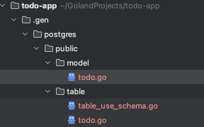

## go path preSetup 

```azure
~/GolandProjects/todo-app main !1 ❯ sudo chown -R $(whoami):staff /Users/{username}/go      
~/GolandProjects/todo-app main !1 ❯ chmod -R 755 /Users/{username}/go
```


# test stack

[GIN]()
[templ]()
[postgres]()
[]()


## templ cli


```azure
export PATH="$PATH:/usr/local/go/bin/bin"
```

## sqlc

[Getting started with PostgreSQL](https://docs.sqlc.dev/en/latest/tutorials/getting-started-postgresql.html)

[sqlc overrides](https://docs.sqlc.dev/en/stable/howto/overrides.html)

[여러분은 pgx pgtype 보일러플레이트를 어떻게 다루고 계신가요?](https://www.reddit.com/r/golang/comments/1h5q7ng/how_are_you_guys_dealing_with_pgx_pgtype/)

```azure
# example
overrides:
   - db_type: "pg_catalog.int4"
     nullable: true
     go_type:
       type:  "int"
```

실제로 써보니 쿼리빌더라기보다, 원시 sql 작성하면 그걸 기반으로 repository 계층 코드를 generate 해주는 코드생성도구에 가깝다.
JVM에서의 JOOQ 같은 걸 기대했는데, 생각보다 더 원시적이다. 런타임에 동적인 코드 생성이 불가능? 한 것 같다. 더 알아보아야 겠지만,
특히 짜증나는 건, postgres 쓰면 pgtype을 import 해줘야 되는데, 이걸 go native type으로 변환시키는 작업을 일일히 해야 된다는 점이다.
위의 overrides 설정을 적용하면 일부 해결이 되는 것 같은데, 또 안 되는 것도 있고 하.. 짜증이 난다. 일단 폐기처분.


## go-jet

[go-jet])(https://github.com/go-jet/jet?tab=readme-ov-file#features)

```azure
$ go get -u github.com/go-jet/jet/v2
go install github.com/go-jet/jet/v2/cmd/jet@latest
jet -dsn='postgresql://localhost:5432/postgres?sslmode=disable' -schema=public -path=./.gen
```


JOOQ 랑 가장 비슷한 형식의 라이브러리 인 듯 하다. 이걸로 정하자.

## golang에서 테스트 코드란?


## DI Container in Go?

[wire](https://github.com/google/wire)
[uber/dig](https://github.com/uber-go/dig)
[inject](https://github.com/facebookarchive/inject)

찾아보니.. 크게 위의 3가지 라이브러리가 주로 쓰이고 있는 것 같다. 가급적 수동 DI를 유지하기로 결정  

## golang에서 환경변수 관리법

godotenv?


## 프로젝트 구조

[Standard Go Project Layout](https://github.com/golang-standards/project-layout/blob/master/README_ko.md)

[대규모 Gin-GORM 웹 서비스 구성: 효과적인 폴더 구조 가이드](https://fenixara.com/organizing-a-large-scale-gin-gorm-web-service-a-guide-to-effective-folder-structure/)

[go-gin-boilerplate](https://github.com/vsouza/go-gin-boilerplate)

## GRPC?


## golang에서 트랜잭션 관리?


## makeFile?


## 컨벤션?

[뱅크샐러드 Go 코딩 컨벤션](https://blog.banksalad.com/tech/go-best-practice-in-banksalad/)


# panic recover 

[panic-and-recover-more](https://go101.org/article/panic-and-recover-more.html)


