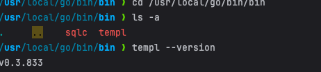

## templ cli



```azure
export PATH="$PATH:/usr/local/go/bin/bin"
```

## sqlc

[Getting started with PostgreSQL](https://docs.sqlc.dev/en/latest/tutorials/getting-started-postgresql.html)


## golang에서 테스트 코드란?

## golang에서 환경변수 관리법

godotenv?


## 프로젝트 구조

[Standard Go Project Layout](https://github.com/golang-standards/project-layout/blob/master/README_ko.md)

[대규모 Gin-GORM 웹 서비스 구성: 효과적인 폴더 구조 가이드](https://fenixara.com/organizing-a-large-scale-gin-gorm-web-service-a-guide-to-effective-folder-structure/)

[go-gin-boilerplate](https://github.com/vsouza/go-gin-boilerplate)

## GRPC?


## golang에서 트랜잭션 관리?


## makeFile?


## 


